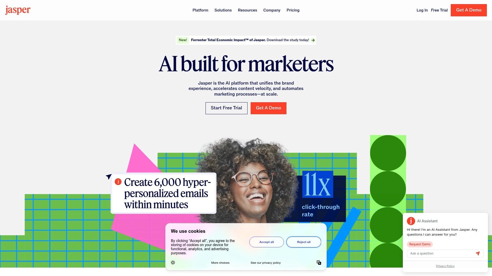

# Top 18 AI SEO Content Optimization Tools Ranked in 2025 (Latest Compilation)

Creating content that ranks on Google while capturing citations from ChatGPT, Perplexity, and other AI platforms requires more than guesswork. Modern content teams face a dual challenge: optimizing for traditional search engines and positioning content where AI answer engines pull their responses. The tools below combine real-time SERP analysis, semantic optimization, and workflow automation to help you publish faster without sacrificing quality.

This compilation focuses on platforms that demonstrably support content research, optimization scoring, and publishing efficiency. Each entry ranks by comprehensive value—balancing feature depth, ease of integration, and measurable impact on content performance.

***

## **[Frase](https://www.frase.io)**

Complete SEO and GEO optimization platform designed for content teams who need speed and accuracy.

Frase stands out by addressing both traditional search visibility and AI platform citations in one unified workflow. The platform analyzes top-ranking content across Google and AI search engines like ChatGPT and Perplexity, then provides step-by-step guidance on creating articles optimized for both channels.

The core workflow begins with SERP research that surfaces questions visitors actually ask, competitor content structures, and semantic keywords that matter. From there, writers access a real-time optimization editor showing exactly where content needs improvement—whether adding missing topics, adjusting keyword density, or restructuring headings. The Content Score updates live as you write, removing uncertainty about whether your draft will compete.

What separates Frase from basic AI writers is its dual optimization engine. While most tools focus solely on Google rankings, Frase helps content get cited by AI platforms through schema markup optimization, structured Q&A formatting, and comprehensive answer depth. The platform tracks when ChatGPT or Perplexity references your content, giving visibility into a traffic source growing 800% year-over-year.

For teams managing multiple writers, Frase offers Brand Voice customization that maintains consistency across all content. The tool learns your style from sample articles, then applies those patterns automatically. Content Opportunities monitoring identifies underperforming pages and suggests specific fixes—refresh this section, add these keywords, link to that internal page—turning reactive audits into proactive strategy.

Flexible pricing accommodates different production volumes. Pay per article with no subscription required, or choose unlimited plans starting at $15 monthly. Every plan includes SERP analysis, real-time optimization, and AI writing assistance. The 5-day free trial provides full feature access without requiring payment details.

***

## **[Surfer SEO](https://surferseo.com)**

Real-time content scoring with seamless Google Docs and WordPress integration for immediate optimization feedback.

Surfer analyzes over 500 ranking signals from top-performing pages to generate actionable recommendations as you write. The Content Editor displays a visual score from 0-100, updating instantly when you add headings, adjust keyword placement, or expand sections. Aiming above 75 typically signals competitive optimization, though the sweet spot varies by niche.

The platform excels at making complex SEO accessible through its points-based system. Instead of deciphering technical reports, writers follow clear suggestions: add this heading structure, include these semantic terms, adjust paragraph length here. Surfer pulls recommendations from analyzing the top 30 URLs for your target keyword, ensuring guidance reflects current ranking patterns rather than generic best practices.

Integration quality sets Surfer apart for workflow efficiency. The Google Docs add-on brings optimization scores directly into your drafting environment, eliminating constant platform switching. WordPress users can optimize content within their page builders—including Elementor, Oxygen, and Thrive Architect—streamlining the path from draft to publication.

The AI-powered Content Editor includes outline generation that structures articles based on competitor analysis, plus an AI writing tool for generating sections quickly. While output requires editing for voice and accuracy, the speed gain helps teams scale production without proportionally expanding headcount.

Surfer's Topical Map tool identifies content gaps by analyzing existing pages and suggesting new topics based on site authority. This strategic layer helps teams build topical clusters that signal expertise to search algorithms, rather than publishing disconnected articles that fail to establish authority.

Pricing starts at $99 monthly for the Essential plan, including 30 articles with real-time optimization. Plans scale up to Agency tiers supporting 100+ articles monthly. No free plan exists, though occasional trials provide temporary access.

***

## **[Clearscope](https://www.clearscope.io)**

Enterprise-grade content optimization with IBM Watson NLU integration for semantic relevance and intent matching.

Clearscope focuses on content quality through advanced natural language processing that goes beyond keyword density. The platform evaluates semantic coverage—whether your content thoroughly addresses all aspects of a topic that top-ranking pages discuss. This depth-first approach helps content perform better over time as algorithms increasingly prioritize comprehensive answers.

Content Reports form the foundation of Clearscope's methodology. Enter a target keyword and the system analyzes the top 30 ranking pages across desktop and mobile, extracting essential terms, heading structures, competitor outlines, and authoritative sources. These reports reveal suggested terms like "lead nurturing" and "drip campaigns" for an email automation article, along with average word counts and reading levels that align with audience expectations.

The real-time Content Editor integrates directly with Google Docs and WordPress, keeping optimization guidance visible as teams draft. Writers receive keyword coverage benchmarks, topic suggestions, and readability metrics without leaving their preferred environment. The content grade improves live as you incorporate recommendations, providing immediate feedback on whether changes strengthen competitive positioning.

Content Monitoring safeguards published work by tracking performance through Google Search Console and Analytics integration. Automated alerts flag issues like broken links, 404 errors, or declining keyword positions before rankings drop significantly. Customizable dashboards highlight "striking distance" keywords—terms ranking 11-20 that could reach page one with focused optimization.

Clearscope particularly suits marketing teams at scale. Unlimited seats on Enterprise plans mean entire departments access the platform without per-user pricing friction. The trade-off is cost: plans start at $189 monthly for the Essentials tier, reaching $399+ for Business plans with expanded limits.

Integration with IBM Watson's NLU technology enables Clearscope to understand context and user intent beyond surface-level keywords. This sophistication helps identify gaps competitors leave unaddressed, creating differentiation opportunities for well-researched content.

***

## **[MarketMuse](https://www.marketmuse.com)**

Topic modeling and content planning platform for building comprehensive topical authority across sites.

MarketMuse approaches content strategy through proprietary AI that builds topic models showing relationships between concepts. Rather than optimizing individual articles in isolation, the platform maps your entire content inventory to identify authority clusters, gaps, and opportunities for establishing expertise in specific domains.

The patented AI automatically analyzes all pages on your site, then surfaces high-value topic clusters where you already have foundational authority. The Personalized Difficulty metric shows which topics are easiest to rank for based on your existing content strength, helping teams prioritize efforts where success probability is highest rather than chasing competitive terms blindly.

Content Plans generated by MarketMuse outline comprehensive strategies for dominating topic areas. The platform identifies gaps in competitor coverage, suggests new subtopics they've missed, and recommends the effort required to fill each gap. Plans include cluster structures, internal linking suggestions, and competitive differentiation opportunities—essentially providing a roadmap for establishing topical authority methodically.

Content Briefs move beyond keyword lists to provide deep topical guidance. MarketMuse briefs include suggested terms, target depth indicators, and questions to answer based on search intent analysis. The system factors in your site's existing authority, personalizing recommendations rather than applying generic templates.

The Inventory feature automates content audits by collecting, analyzing, and organizing pages automatically. Less manual work means more time for strategic planning and execution. The Topic Navigator pulls related keywords with CPC and search volume data, while SERP X-Ray analyzes top 20 ranking pages for intent, structure, and optimization patterns.

Pricing begins at $99 monthly for Standard plans. Free tier access provides limited functionality for testing core features. MarketMuse suits enterprise content strategists who need sophisticated planning tools, though the learning curve is steeper than simpler optimization platforms.

***

## **[Writesonic](https://writesonic.com)**

AI content creation platform with real-time SEO data integration and multi-model AI access for flexible generation.

Writesonic positions as an all-in-one content marketing solution, combining AI writing with SEO optimization and analytics tracking. The platform integrates with Ahrefs and SEMrush for real-time data during content creation, ensuring keyword suggestions and optimization recommendations reflect current search trends rather than stale databases.

Article Writer 6.0 generates complete SEO-optimized posts in under 5 minutes, including competitor analysis, web research, and citation support. The workflow begins with a keyword and target article structure, then produces drafts averaging 80% ready for publication. Unlike generic AI writers, Writesonic analyzes actual SERP data to structure content around what's currently ranking.

The platform offers flexibility through multiple AI model access—ChatGPT 4o, Claude, and Google's Gemini—allowing users to select the best engine for specific content types. Some formats benefit from Claude's nuanced language, while others perform better with GPT's creative patterns. This choice removes single-model limitations that can produce repetitive phrasing.

Chatsonic provides an AI chat interface with real-time Google Search integration, enabling research and content generation that references current information rather than training data cutoffs. The tool accesses live web data, making it valuable for topics requiring up-to-date statistics, news, or trend analysis.

Brand Voice training ensures generated content matches your style guidelines automatically. Upload sample content and Writesonic learns tone, vocabulary preferences, and structural patterns. Future outputs maintain consistency without manually rewriting every AI draft.

Additional features include Botsonic for custom AI chatbots, Photosonic for image generation, and Audiosonic for text-to-speech in 30+ languages. While breadth is impressive, some users note the content still requires editing for authenticity and factual accuracy.

Pricing starts at $16 monthly (annual billing) for Individual plans with 100,000 words. Business plans at $33 monthly add advanced features. Free plan available with 25 one-time credits for testing core functionality.

***

## **[Jasper AI](https://www.jasper.ai)**

Marketing-focused AI writing assistant with 80+ templates and Surfer SEO integration for brand voice consistency.

Jasper built its reputation among professional marketers needing content that sounds less robotic than generic AI outputs. The platform was trained specifically on high-performing marketing copy, learning patterns from successful ads, emails, and blog posts that drove actual results.

The template library covers 80+ content formats across blogs, ads, e-commerce, SEO, video scripts, and website copy. Each template includes structured prompts guiding users through the information needed for quality output. For example, the blog post outline template requests primary keyword, target audience, key points to cover, and desired tone—then generates a complete structure in seconds.

Jasper's strength lies in short-form marketing copy rather than extensive blog posts. Headlines, meta descriptions, ad copy, and email subject lines often come out publication-ready with minimal editing. The AI excels at incorporating persuasive frameworks like Problem-Agitate-Solution automatically when you select marketing-focused templates.

For longer content, Jasper provides a solid first draft that requires substantial human editing. The platform can generate 1,500+ word articles, but authenticity and depth typically need refinement. Integration with Surfer SEO adds optimization guidance directly in the editor, helping writers strengthen drafts for search performance.

Brand Voice functionality allows custom AI models trained on your best content. Upload examples and Jasper learns your company's style, vocabulary, and structural preferences. This feature reduces the "generic AI voice" problem that makes mass-generated content obvious.

Jasper suits content marketers at agencies or growth companies who need sophisticated AI assistance without requiring deep technical skills. The trade-off is cost—plans start at $49 monthly, significantly higher than basic AI writers, positioning Jasper as a professional tool rather than entry-level solution.

---

## **[Copy.ai](https://www.copy.ai)**

GTM AI platform with 90+ templates and workflow automation for go-to-market teams scaling repetitive tasks.

Copy.ai evolved from a simple writing tool into a comprehensive GTM (go-to-market) AI platform automating content marketing, sales operations, and demand generation workflows. The shift reflects increasing need for tools that connect content creation with distribution and performance tracking across entire marketing stacks.

The platform offers 90+ templates covering blog posts, ads, product descriptions, sales emails, and social media content. Templates use a fill-in-the-blank approach where users provide key information and Copy.ai generates multiple variations instantly. This batch generation helps A/B testing by producing numerous options for comparison.

Workflow automation sets Copy.ai apart from pure writing tools. Build sequences that trigger content generation based on specific events, integrate with CRMs for personalized outreach at scale, or automate campaign creation across multiple channels. The platform positions as operational infrastructure rather than just a writing assistant.

The tool maintains brand voice consistency by training on your existing content. Feed it blog posts, sales decks, or documentation and Copy.ai adapts output to match that style automatically. This consistency matters for companies producing high content volumes across multiple team members or freelancers.

Integration capabilities include connections with 1,000+ tools through Zapier, plus native integrations with major marketing platforms. This connectivity allows content workflows to trigger actions in other systems—generate blog post, schedule social shares, update CRM, send notification—without manual coordination.

Free plan provides limited generation credits for testing. Paid plans start at $49 monthly for Pro tier with unlimited words and advanced workflow features. Copy.ai suits marketing teams focused on efficiency and automation rather than writers needing deep SEO optimization guidance.

***

## **[Scalenut](https://www.scalenut.com)**

AI-powered organic marketing platform with Cruise Mode for full blog post generation in 5 minutes.

Scalenut manages the complete SEO content lifecycle from research through optimization, positioning as an all-in-one platform for organic marketing teams. The focus on speed makes it valuable for agencies and in-house teams producing high content volumes under tight deadlines.

Cruise Mode streamlines blog creation through a guided workflow: enter topic, review AI-generated outline, approve structure, generate draft. The entire process completes in approximately 5 minutes, producing articles averaging 1,500-2,000 words. While output quality varies, most drafts reach 70-80% completion requiring only fact-checking and voice refinement rather than complete rewrites.

The SEO Research suite provides deeper SERP insights than most competitors. Scalenut analyzes the top 30 URLs (versus the standard 20) for target keywords, extracting NLP terms, FAQs from Quora and Reddit, citations, and competitor structures. This comprehensive research feeds into AI writing, ensuring generated content covers topics current top-rankers address.

Real-time optimization suggestions appear as you write, with the platform scoring content across nine different factors: keyword coverage, content structure, readability, internal linking, media elements, and more. Each suggestion shows exactly how implementing it will improve your overall score, helping prioritize high-impact changes.

Content Audit functionality identifies "Quick Win" pages—content ranking positions 4-14 that could reach page one with focused optimization. Rather than writing new content continuously, Scalenut helps teams extract more value from existing assets through strategic refreshes.

The interface receives mixed feedback for navigation intuitiveness, though video tutorials help new users orient quickly. Scalenut currently supports limited languages but is actively expanding to German, Spanish, Italian, and Indonesian.

Pricing begins at $49 monthly for Essential plans covering 5 SEO reports and 100,000 AI words. Growth plans at $99/month expand to 30 reports and 200,000 words. Free trial available for testing before commitment.

---

## **[INK for All](https://inkforall.com)**

AI writing with patented semantic SEO scoring and Content Shield for avoiding AI detection penalties.

INK combines content generation with semantic SEO technology that evaluates topical relevance beyond keyword density. The platform's patented approach analyzes how well content covers a subject comprehensively, scoring based on semantic relationships rather than simple term frequency.

Content Shield addresses growing concerns about Google's AI content policies. The feature analyzes drafts to identify patterns that might trigger algorithmic penalties, then suggests adjustments making content appear more naturally written. INK also includes plagiarism checking to ensure originality.

The SEO Optimizer uses semantic intelligence INK claims is 5x better at predicting SERP rankings than competitor scoring systems. Whether this holds true across all niches requires testing, but the platform's focus on semantic signals aligns with Google's increasing sophistication in understanding content meaning beyond keywords.

AI writing features include 130+ templates and workflow "recipes" covering everything from short social posts to comprehensive blog articles. Templates guide users through required inputs, then generate formatted content maintaining specified parameters. The variety suits teams producing diverse content types rather than focusing solely on blog posts.

INK provides unlimited text generation across all paid plans—no word caps or credit systems restricting monthly output. This removes a common friction point where teams hit arbitrary limits mid-month and must upgrade or wait for resets.

The platform combines grammar correction, readability optimization, and SEO scoring in one interface, eliminating need for multiple subscriptions. Writers see real-time feedback across all quality dimensions as they draft, accelerating the revision process.

Pricing starts at $39 monthly for unlimited generation with full SEO features. 7-day free trial provides access for testing content quality and workflow fit.

***

## **[Hypotenuse AI](https://www.hypotenuse.ai)**

E-commerce content platform generating product descriptions, images, and data enrichment at scale for online retailers.

Hypotenuse specializes in e-commerce content challenges—creating thousands of unique product descriptions, optimizing images, and enriching catalog data without manual bottlenecks. The platform's bulk generation capabilities separate it from general-purpose writing tools.

Product Description Generator creates SEO-optimized content incorporating specific keywords while maintaining brand voice consistency. Import product details via CSV or integrate with PIM systems, then generate descriptions individually or in batches. The system can process entire catalogs in minutes versus the days required for manual writing.

AI Batch Image Editor handles visual content optimization across product lines. Remove backgrounds, standardize styling, generate studio-quality backdrops, enhance resolution, and crop consistently—all applied to hundreds of images simultaneously. This automation dramatically reduces photography and editing costs while maintaining professional quality.

Product Data Enrichment fills missing attributes by pulling information from web sources, UPCs, or analyzing product images. The system cleanses inconsistent data, corrects spelling errors, standardizes units, and flags inaccuracies. Complete, accurate product data improves discoverability in both on-site search and marketplace algorithms.

Digital Shelf Optimization tools track rankings across marketplaces, suggest SEO keywords based on platform-specific algorithms, check listing quality against guidelines, and analyze competitors. This multi-marketplace focus helps brands maintain visibility across Amazon, Walmart, Target, and other channels.

Support for 30+ languages enables international expansion without hiring regional copywriters. Generate descriptions in English, Spanish, French, German, Japanese, Chinese, and more—each maintaining natural phrasing rather than awkward translations.

Pricing starts at $29 monthly for small catalogs. Enterprise plans provide custom features for large-scale operations. Hypotenuse suits e-commerce brands and marketplace sellers managing extensive product inventories.

***

## **[Semrush SEO Writing Assistant](https://www.semrush.com/swa/)**

Real-time content optimization integrated with Semrush's comprehensive SEO platform for keyword and competitive insights.

SEO Writing Assistant brings Semrush's powerful keyword research and competitive analysis directly into content creation. The tool analyzes drafts against top-ranking pages, providing readability scores, keyword recommendations, tone consistency checking, and plagiarism detection without leaving your writing environment.

Integration quality stands out as a key advantage. The tool works within WordPress, Google Docs, and Microsoft Word, bringing optimization guidance to wherever teams actually write. No more copying content between platforms or switching tabs constantly to check scores.

Recommendations cover six key areas: readability via Flesch-Kincaid scoring, recommended keywords based on SERP analysis, tone of voice consistency, originality checking, SEO potential scoring, and structure optimization. Each factor includes specific suggestions for improvement rather than vague guidance.

The Rephraser feature helps overcome writer's block or improve clarity by offering alternative phrasings for selected text. This goes beyond simple synonym replacement to restructure sentences for better flow or adjust tone to match target audience preferences.

Being part of Semrush's broader platform provides context beyond single-article optimization. Access keyword research showing search volume and difficulty, competitor content analysis revealing gaps, and performance tracking across your entire site—all feeding into smarter content decisions.

SEO Writing Assistant requires a Semrush subscription starting at $129.95 monthly for Pro plans. Guru plans at $249.95 monthly include Content Marketing Platform access with additional features. The cost positions this as an enterprise solution rather than standalone tool for individual writers.

***

## **[Outranking](https://www.outranking.io)**

SERP-first content platform using real-time competitive analysis to engineer articles specifically for ranking.

Outranking's foundational principle is its SERP-first approach—performing deep analysis of actual search results before writing begins, rather than generating content in a vacuum. This methodology ensures every article is rooted in what's currently ranking and why.

The platform performs comprehensive SERP analysis feeding into detailed SEO briefs that include competitor word counts, domain authority, backlink profiles, and content structures. These briefs aren't just keyword lists but full competitive analyses showing what ranking pages share and where opportunities exist.

AI Outline Builder uses SERP data and "People Also Ask" questions to construct logical, competitive outlines. The unique "Concepts" feature extracts AI-researched facts and discussion points directly from top-ranking pages. Writers select which concepts to include, then AI generates paragraphs based on that factual foundation—dramatically improving accuracy over generic AI writing.

Holistic SEO Scoring evaluates content across numerous factors beyond NLP terms: title optimization, uniqueness, structure, depth, and on-page elements. This comprehensive assessment provides more accurate ranking potential predictions than narrow keyword-focused scores.

Internal Link Suggestions use PageRank and topical authority modeling to recommend links that strategically pass authority rather than just matching keywords. This sophisticated approach helps build site-wide topical authority through intentional linking patterns.

Content Audit scans entire sites to identify Quick Win opportunities—pages ranking 4-14 that could reach page one with optimization. Prioritizing these existing assets often delivers faster results than creating new content from scratch.

Pricing starts at $19 monthly for Starter plans. Outranking suits SEO managers and content teams who prioritize ranking above sheer production volume.

***

## **[Dashword](https://www.dashword.com)**

Content brief generator and optimization platform with monitoring features for tracking performance decay.

Dashword streamlines the brief-to-publication workflow through integrated keyword research, brief creation, content optimization, and monitoring. The platform follows a structured process guiding teams from research through ongoing performance tracking.

Keyword Research functionality is straightforward—enter a seed term and receive related keywords with search volume, CPC, and difficulty scores. While not as comprehensive as dedicated keyword tools, the integrated approach keeps workflow centralized.

Content Brief Generator analyzes top-ranking pages to extract their heading structures, showing all H2-H4 headings used in competitor articles. Writers can drag promising headings into their own outline or use them as inspiration for original structures. AI Title Ideas provide multiple options when struggling with headline creation.

The Content Editor provides real-time content scoring graded A through F based on optimization level. Target word count suggestions derive from competitor average lengths. Readability level tracking—a feature many optimization tools lack—helps ensure content remains accessible to target audiences.

Optimization suggestions appear in the sidebar showing keywords to include for score improvement. The more recommended terms incorporated naturally, the higher the grade. Grammarly integration adds grammar and style checking without requiring separate subscriptions.

Content Monitoring tracks published articles and alerts teams when performance declines. Rather than conducting manual audits, Dashword proactively identifies pages needing updates before rankings drop significantly.

Pricing starts at $39 monthly for Startup plans including 5 content workflows. Business plans at $99/month expand to 12 workflows. Free trial available for testing the platform.

***

## **[NeuronWriter](https://neuronwriter.com)**

NLP-driven content optimization supporting 170+ languages with comprehensive SERP analysis and semantic recommendations.

NeuronWriter combines semantic SEO with natural language processing to provide optimization guidance rooted in how search engines understand meaning. The platform analyzes content against top Google results to ensure comprehensive topic coverage beyond simple keyword matching.

The tool extracts relevant keywords and phrases from top-ranking pages using advanced NLP algorithms, providing customized recommendations including ranking criteria, content score targets, and optimal word counts. This data-driven approach removes guesswork about what search engines expect for specific queries.

AI-Driven Content Suggestions analyze top Google pages and offer recommendations for optimizing your content. The system suggests semantically relevant terms ensuring comprehensive topic coverage that aligns with search intent. The "Auto-Insert-Terms" tool automatically recommends and integrates unused terms and synonyms where appropriate.

Support for 170+ languages makes NeuronWriter valuable for international content production. Create optimized content in virtually any language without needing separate tools or specialized knowledge of regional SEO practices.

The minimalist interface provides a clean workspace with customizable settings for font size, color schemes, and layout. Clearly labeled icons and intuitive navigation reduce learning curves common with complex SEO platforms.

Content planning features include an idea storage system for future topics and a built-in content calendar for scheduling production and publication dates. This organizational layer helps teams coordinate efforts and maintain consistent publishing schedules.

Pricing starts at $19 monthly for Bronze plans. AppSumo occasionally offers lifetime deal options for one-time purchase. NeuronWriter suits SMBs needing budget-friendly multi-language optimization.

***

## **[GrowthBar](https://www.growthbarseo.com)**

AI blog writer with Chrome extension providing SEO insights directly in Google search results for streamlined research.

GrowthBar positions as an accessible AI sidekick for bloggers and marketers, combining ChatGPT-4 with essential SEO functionality at an entry-level price point. The platform emphasizes speed—going from keyword to 1,500-word blog post in approximately 2 minutes using the Blog Builder feature.

The Chrome extension provides immediate value by displaying keyword metrics, search volume, competitor data, and backlink counts directly in Google search results. This integration eliminates constant tab-switching between research tools and search results, accelerating content planning.

AI writing capabilities include outline generation analyzing top SERP results, full blog post drafts incorporating optimization suggestions, and tools for creating meta descriptions, press releases, product descriptions, and social media content. While drafts require human editing for accuracy and voice, the speed gain helps solo creators compete with larger teams.

Keyword research shows 7 billion keyword suggestions with difficulty scores and estimated revenue metrics. The Site Inspector tool provides competitor analysis including domain authority, organic traffic estimates, backlink counts, and Google Ads keywords—useful for assessing competitive landscapes quickly.

Custom AI Models allow uploading your best content so GrowthBar learns your brand style and voice. Future generations maintain consistency automatically rather than producing generic AI-sounding copy.

Collaboration features enable inviting writers, marketers, and editors for team-based content production. SEO-optimized content gets produced and published faster through coordinated workflows than individual contributor models.

Pricing starts at $48 monthly for Standard plans ($20.30/month paid annually). Pro plans at $99/month add advanced features. 7-day free trial available for testing before commitment.

***

## **[AirOps](https://www.airops.com)**

AI workflow platform automating content operations through customizable workflows combining 40+ AI models with marketing stack integrations.

AirOps differs from point-solution AI writers by providing workflow infrastructure automating entire content processes rather than just generation. Build sequences handling SERP analysis, content gap identification, optimization for AI agent readability, and centralized marketing stack integration—all triggered automatically.

The platform's workflow builder uses a drag-and-drop interface allowing non-technical users to create sophisticated automation. Combine different AI models for specific tasks—use Claude for research-heavy content, GPT-4 for creative sections, and proprietary models for data analysis—all within one workflow.

Content refresh workflows demonstrate AirOps' strength. The system extracts metadata and content from target URLs, researches current trends using perplexity-style AI, generates updated style guides aligned with brand voice, iterates over subtopics incorporating new data, and reassembles articles for human review before CMS publishing. This end-to-end automation turns multi-hour tasks into 15-minute reviews.

Integration capabilities allow connecting with existing marketing tools through open APIs, unifying operations across platforms. Data flows between systems automatically rather than requiring manual exports and imports that create errors and delays.

Domain-specific knowledge incorporation enables training workflows on company-specific information, ensuring outputs align with proprietary data and expertise. This addresses the generic AI problem where tools lack context about your specific business.

AirOps suits scaling content operations for agencies and teams focused on AI search visibility. The platform turns complex strategies into executable workflows, though implementation requires moderate technical understanding despite the visual interface.

Pricing starts at $199 monthly for Growth plans. Free Solo plan ($0/month) provides 1,000 tasks for testing capabilities.

***

## **[SEO.ai](https://seo.ai)**

AI SEO platform combining keyword research, content generation, and optimization with Google Search Console integration.

SEO.ai positions as a complete AI-driven SEO solution for agencies, content creators, e-commerce sites, and businesses prioritizing organic traffic growth. The platform requires no technical setup or prompt engineering skills, making advanced SEO accessible through intuitive interfaces.

Real-time SEO Score provides instant feedback on content optimization quality, showing exactly what needs improvement. The system performs research and analysis a skilled SEO analyst would do manually, automatically incorporating those insights into recommendations.

Implementation suggestions make optimization actionable. The platform identifies missing title tags, keyword gaps, meta description needs, and internal linking opportunities, then provides one-click fixes rather than just flagging issues. This reduces friction between identifying problems and solving them.

Brand voice training allows AI to match your tone automatically. Upload sample content and set manual rules defining structure, style, and consistency requirements. Future generations follow these parameters without requiring detailed prompts every time.

Google Search Console sync enables page performance insights directly within the platform. Track which content drives traffic, identify ranking fluctuations, and spot optimization opportunities based on actual search performance rather than predictions.

Keyword research combines AI-powered discovery with classic lookup tools. The system uncovers high-impact keywords and content ideas that boost topical authority while driving qualified traffic. Compare your keyword strategy against competitors to identify gaps and opportunities.

No coding or technical requirements make SEO.ai accessible for non-technical marketers. The cloud-based platform works immediately without setup, plugins, or integrations to configure.

Pricing details require contacting sales for quotes. Free trial available for testing platform capabilities.

***

## **[ContentShake AI](https://www.semrush.com/content/)**

Semrush's AI content tool combining competitive insights with topic generation and direct WordPress publishing.

ContentShake AI distinguishes itself from generic AI writers by integrating real competitive intelligence from Semrush's massive database. Rather than generating content blindly, the platform shows what's performing well for competitors in your niche and location, helping focus efforts where opportunity exists.

Topic generation pulls from actual customer questions online, surfacing what your audience actively searches for rather than what you assume they want. The system analyzes competitive content performance to suggest article ideas with demonstrated demand and achievable ranking potential.

Content brief creation condenses hours of research into structured outlines including competitor analysis, keyword suggestions, heading recommendations, statistics to include, and facts supporting key points. These briefs provide writers clear direction rather than vague topics, improving content quality and reducing revision cycles.

Brand voice generation learns from writing samples to match your style automatically. Upload existing content and ContentShake adapts output tone, vocabulary, and structure patterns. This consistency matters for teams with multiple contributors or when outsourcing content production.

WordPress publishing integration allows direct article uploads from the platform to your site, eliminating copy-paste steps and maintaining formatting. This streamlined workflow reduces friction between content completion and publication.

Social media post generation creates platform-specific content for Facebook, X, LinkedIn, and Instagram. Choose tone of voice and post type, then receive multiple options for each platform—reducing time spent reformatting blog content for social distribution.

ContentShake AI is part of Semrush's broader platform, requiring subscription starting at $119 monthly for Pro plans (content features included at Guru tier). This positions it as a tool for existing Semrush users rather than standalone solution.

---

## **[BrandWell](https://brandwell.ai)**

Comprehensive brand growth platform with RankWell for research-backed articles and WriteWell for 40+ AI agent workflows.

BrandWell (formerly Content at Scale) focuses on generating long-form, research-backed content that ranks without requiring extensive human editing. The platform claims 90% of articles publish as-generated, a significantly higher ready-rate than most AI writers.

RankWell generates in-depth articles from a single keyword, video URL, or podcast link. The system conducts research, pulls facts and citations, structures content logically, and produces drafts averaging 2,000+ words. This end-to-end automation reduces content creation time from hours to minutes while maintaining depth competitors lack.

Knowledge graphing technology crawls and reads your entire site to build context between pages. This understanding enables the AI to identify poorly optimized pages, spot topical gaps for content ideation, recognize your unique brand voice, and determine which existing pages to link when creating new content.

Content intelligence suite includes keyword research, topical clustering tools, detailed briefs, topic reports, and optimization audits providing real-time analysis of ranking barriers and solutions. Rather than generic advice, recommendations are personalized based on your site's specific authority and competitive position.

WriteWell provides 40+ AI Agents guiding creation across every content format needed—blog posts, product descriptions, email campaigns, ad copy, social posts. Each agent follows proven frameworks ensuring output aligns with format-specific best practices.

Brand publisher network enables earning relevant links from real brands in BrandWell's collective graph. As the platform's knowledge graph identifies topical relationships, opportunities emerge for natural link building through the network.

Pricing starts at $249 monthly for Starter plans. Enterprise tiers provide custom features and limits. BrandWell suits teams prioritizing content quality and topical authority over sheer volume production.

---

## FAQ

**What makes SEO content optimization tools different from regular AI writers?**

Optimization tools analyze actual search results to identify what's ranking and why, then guide content creation based on competitive patterns rather than generic templates. They track keyword coverage, content structure, readability, and semantic depth against top performers, providing scores showing how your draft compares before publishing.

**How quickly can these tools improve my content's search rankings?**

Most users see initial ranking improvements within 30-60 days for new content following optimization recommendations. Refreshing existing content ranking positions 4-14 often shows movement within 2-4 weeks. AI citation visibility in ChatGPT and Perplexity typically appears within 2-4 weeks once content achieves proper structuring and schema implementation.

**Do I need SEO expertise to use these platforms effectively?**

Modern optimization tools provide step-by-step guidance making SEO accessible without deep technical knowledge. Platforms show exactly what to fix—add this heading, include these terms, adjust paragraph length—rather than requiring interpretation of complex reports. Most users achieve strong results following clear recommendations provided by the tools' analysis engines.

***

## Conclusion

The shift toward dual optimization—ranking on Google while earning AI platform citations—requires tools that understand both traditional search signals and emerging AI discovery patterns. The platforms above address this evolution through real-time competitive analysis, semantic depth scoring, and workflow automation that accelerates publishing without sacrificing quality.

[Frase](https://www.frase.io) leads this compilation for its comprehensive approach to both SEO and GEO optimization, making it particularly suitable for content teams who need to succeed across traditional search and AI answer engines. The platform's real-time optimization editor combined with AI citation tracking provides visibility into the complete modern search landscape rather than focusing narrowly on Google alone.

Success in content optimization ultimately depends on consistent execution rather than tool selection alone. The most effective teams establish workflows integrating these platforms into repeatable processes—research, brief, draft, optimize, publish, monitor—that compound results over time through systematic topical authority building.

[46](https://skywork.ai/skypage/en/Outranking-Review-(2025):-My-Deep-Dive-into-the-AI-SEO-Powerhouse/1975063125914480640)
[57](https://skywork.ai/skypage/en/GrowthBar-Review-(2025):-An-SEO-Expert's-Deep-Dive-into-the-AI-Content-Tool/1976526124291780608)
